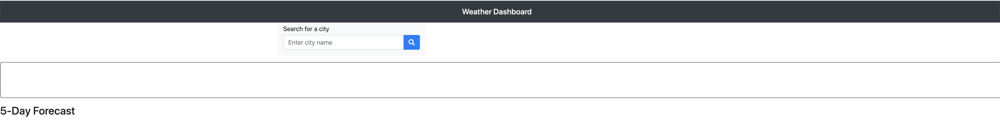

On this project we will show the current weather forecast for a specific city. The user will input the name of the city and the app will display the current weather and the forecast for the next five days.

Deployed webpage link:

https://diegocortes4.github.io/weather-dashboard/

Screenshot of the webpage:

Credits:

https://getbootstrap.com/
https://developer.mozilla.org/en-US/
https://W3schools.com
https://fontawesome.com/ 
